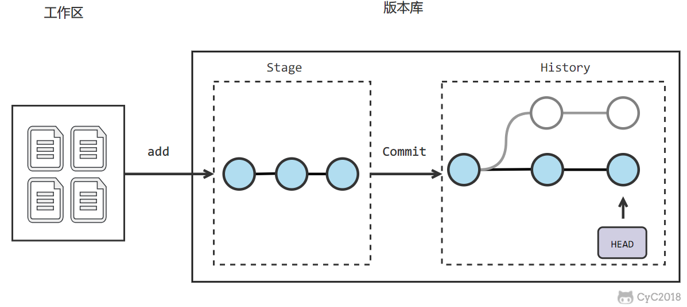

* [集中式与分布式](#集中式与分布式)
* [工作流](#工作流)

# 集中式与分布式
Git 属于分布式版本控制系统，而 SVN 属于集中式。  

* 集中式版本控制只有中心服务器拥有一份代码，而分布式版本控制每个人的电脑上就有一份完整的代码。 
* 集中式版本控制有安全性问题，当中心服务器挂了所有人都没办法工作了。
* 集中式版本控制需要连网才能工作，如果网速过慢，那么提交一个文件的会慢的无法让人忍受。而分布式版本控制不需要连网就能工作。
分布式版本控制新建分支、合并分支操作速度非常快，而集中式版本控制新建一个分支相当于复制一份完整代码。

# 工作流
新建一个仓库之后，当前目录就成为了工作区，工作区下有一个隐藏目录 .git，它属于 Git 的版本库。

Git 的版本库有一个称为 Stage 的暂存区以及最后的 History 版本库，History 中存有所有分支，使用一个 HEAD 指针指向当前分支。

